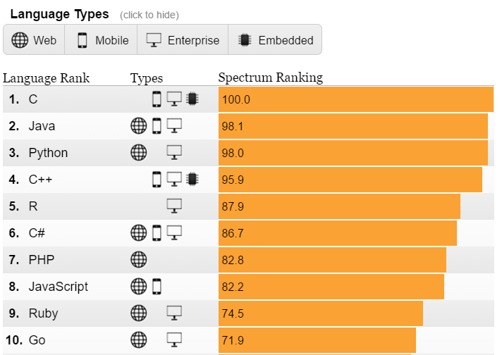
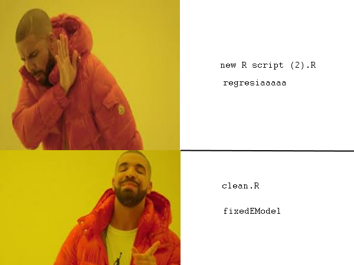

<div class="header" style="margin-top:0 px;font-size:60%;">სმდაRგ: პირველი შეხვედრა</div>

სტატისტიკურ მონაცემთა დამუშავება და ანალიზი R-ის გარემოში
========================================================
author: დავით სიჭინავა
date: 13 თებერვალი, 2022
autosize: true
transition: none
css: css/style.css
font-family: 'BPG_upper'
<span style="font-weight:bold; font-family:BPG_upper;">პირველი შეხვედრა</span>


დღევანდელი შეხვედრის გეგმა
========================================================
incremental: true

- კურსის გაცნობა და ლოგისტიკა
  - საჭირო კომპიუტერული პროგრამები
  - დავალებები, ლაბორატორიული სამუშაო და ა.შ.
- R გარემო

რას გავიგებ ამ კურსის ფარგლებში?
========================================================
incremental: true

- ვნახავთ, თუ როგორაა შესაძლებელი მონაცემთა ეფექტურად მოგროვება და გაანალიზება;
- შევისწავლით რაოდენობრივ მონაცემთა სტატისტიკური ანალიზის ძირითად პრინციპებს;
- გავერკვევით R-გარემოში მუშაობის მთავარ საკითხებში

რა დამჭირდება ამ კურსისთვის?
========================================================
incremental: true

- R;
- R-studio;
- დაწვრილებით: ლაბორატორიის მსვლელობისას


კურსის სტრუქტურა: 
========================================================
incremental: false

  ლექცია
 
 ლაბორატორია

- პრაქტიკული სავარჯიშოები R-ის გამოყენებით
- დაეთმობა შეხვედრების მეორე საათი


კურსის სტრუქტურა: 
========================================================
incremental: false

  ლექცია
 
 ლაბორატორია

კურსის სტრუქტურა: 
========================================================
 ლიტერატურა
- ძირითადი ტექსტები:
+ Imai, K.: [_Quantitative Social Science, An Introduction_](https://www.dropbox.com/s/3wb6t5igedhqjih/QSS.pdf?dl=0). Princeton University Press. 2017 (QSS)
+ Grolemund, G. & Wickham, H.: [_R for Data Science_](http://r4ds.had.co.nz/) (R4DS)
+ Dalgaard, Peter. [_Introductory statistics with R_](https://www.dropbox.com/s/vus2di6528t1513/IntroR.pdf?dl=0). Springer Science & Business Media, 2008. (ISR)

კურსის სტრუქტურა: 
========================================================
incremental: false

  ლექცია
 
 ლაბორატორია

 ლიტერატურა

 დავალებები
- საკითხიდან გამომდინარე, ლექციის ან კვირის ბოლოს გადმოგიგზავნით პრაქტიკულ დავალებებს, რომლებზეც იმუშავებთ.

დავიწყოთ?
========================================================
incremental: false
+ დავრწმუნდეთ, რომ ყველა თქვენგანს აქვს დაინსტალირებული `R` და `R-Studio`
+ თუ არა, ჯერ ჩამოტვირთეთ და დააყენეთ `R`
+ შემდეგ - `R Studio`


დავიწყოთ?
========================================================
incremental: false


R-გარემოს გაცნობა
====================================
type: subsection

- შესავალი R-გარემოში
-  R-ის მომხმარებლის გრაფიკული გარემო: R-Studio
- R-ის მომხმარებლის გრაფიკული გარემოს ძირითადი ელემენტები
- R-მარკირების დოკუმენტის შექმნა
- ,,წიგნიერი პროგრამირება’’ და პროექტების ორგანიზების კარგი პრაქტიკა


რა არის R?: 
========================================================
incremental: false


რა არის R?: 
========================================================
incremental: false

- დაპროგრამების ენა

რა არის R?: 
========================================================
incremental: false

- (ერთ-ერთი ყველაზე ხშირად გამოყენებადი) დაპროგრამების ენა



რა არის R?: 
========================================================
incremental: false

- დაპროგრამების ენა
- ვრცელდება უფასოდ
  - GPL2-GPL3 ლიცენზია
- ხელმისაწვდომია ყველა პოპულარული საოპერაციო პლატფორმისთვის
 
რა არის R?: 
========================================================


რა არის R-Studio?: 
========================================================
incremental: true

R-ის ნაკლად კარგა ხანი ითვლებოდა მოსახერხებელი სამომხმარებლო გარემოს არარსებობა

R-Studio ამ პრობლემის მოსაგვარებლად არსებობს

რა არის R-Studio?: 
========================================================
incremental: true


დახმარება: 
========================================================


```r
### ზოგადი დახმარება:
help.start()
```

დახმარება: 
========================================================


```r
### დახმარება რომელიმე ფუნქციასთან დაკავშირებით
help(lm) ## ან
?lm

### მაგალითის ჩვენება
example(lm)


### ფუნქციის / ბიბლიოთეკის ვინიეტის ჩვენება
vignette("ggplot2-specs")
```

სამუშაო დირექტორია: 
========================================================


```r
getwd()
```

სამუშაო დირექტორია: 
========================================================


```r
setwd("D:/Dropbox/R/My awesome research")
```
ან


```r
setwd("D:\\Dropbox\\R\\My awesome research")
```

ან


```r
setwd('D:\\Dropbox\\R\\My awesome research')
```

ბიბლიოთეკები: 
========================================================


```r
install.packages("ბიბლიოთეკის სახელწოდება")
```


```r
library("ბიბლიოთეკის სახელწოდება")
```

კვლევის დოკუმენტირება და განმეორებადობა (რეპლიკაცია) 
========================================================


<span style="width: 100%;text-align: center; font-size:14px">წყარო: Baker, M. (2016): Is there a reproducibility crisis? Nature. Vol. 533.</span>


კვლევის დოკუმენტირება და განმეორებადობა (რეპლიკაცია) 
========================================================
მაგრამ...

> The lexicon of reproducibility to date has been multifarious and ill-defined. The causes of and remedies for what is called poor reproducibility, in any scientific field, require a clear specification of the kind of reproducibility being discussed (methods, results, or inferences), a proper understanding of how it affects knowledge claims, scientific investigation of its causes, and an improved understanding of the limitations of statistical significance as a criterion for claims

<span style="width: 100%;text-align: center; font-size:14px">Goodman, S., Fanelli, D., Ioannidis, J. (2016): [What does research reproducibility mean?](http://d3ukwgt0ah4zb1.cloudfront.net/content/scitransmed/8/341/341ps12.full.pdf)</span>

კვლევის დოკუმენტირება და განმეორებადობა (რეპლიკაცია) 
========================================================
incremental: true
* სტანდარტები (King, 1995):
> The replication standard holds that sufficient information exists with which to understand, evaluate, and build upon a prior work if a third party can replicate the results without any additional information from the author
* მონაცემთა საცავები (Dataverse @ Harvard, Figshare)
* ვერსიათა კონტროლი (Git, Github, Bitbucket)

<span style="width: 100%;text-align: center; font-size:14px">წყარო: Marwick, B. (2014): [Reproducible Research: A primer for the social sciences](http://benmarwick.github.io/CSSS-Primer-Reproducible-Research/)</span>


სკრიპტები: 
========================================================


```r
source("MyAwesomeRegression.R")
```


წიგნიერი პროგრამირება: 
========================================================


წიგნიერი პროგრამირება: 
========================================================

> Documentation must be regarded as an integral part of the process of design and coding. A good programming language will encourage and assist the programmer to write clear, self-documenting code, and even perhaps to develop and display a pleasant style of writing.

<span style="width: 100%;text-align: center; font-size:14px">Hoare, T. (1973): Hints on Programming Language Design. [in:] Knuth, D. (1983): [Literate Programming](http://roxygen.org/knuth-literate-programming.pdf). _The Computer Journal_</span>

პროექტის ორგანიზების საუკეთესო პრაქტიკა:
========================================================

* გამჭვრივალეობა
* მხარდაჭერა
* მოდულების ფორმით ორგანიზება
* პორტატულობა

პროექტის ორგანიზების საუკეთესო პრაქტიკა:
========================================================

1. პროგრამის მოკლე აღწერა
2. ყველა საჭირო ბიბლიოთეკის ჩატვირთვა
3. აბსოლუტური მისამართის თავიდანვე მითითება, ხოლო შემდეგ - ფარდობით დირექტორიებში მუშაობა
4. კოდის სექციებად მოწესრიგება
5. ფუნქციები
6. ობიექტთა თანმიმდევრული სახელდება
7. ფოლდერების და ფაილების ლოგიკური მოწესრიგება

პროექტის ორგანიზების საუკეთესო პრაქტიკა:
========================================================





მონაცემების წაკითხვა ჩაშენებული ფუნქციების მეშვეობით:
========================================================


```r
### ტაბით გამოყოფილი ცხრილი

1   6   a
2   7   b
3   8   c
4   9   d
5   10  e

### მძიმით გამოყოფილი ცხრილი

v1,v2,v3
1,2,3
4,5,6
7,8,9
a,b,c
```


========================================================


